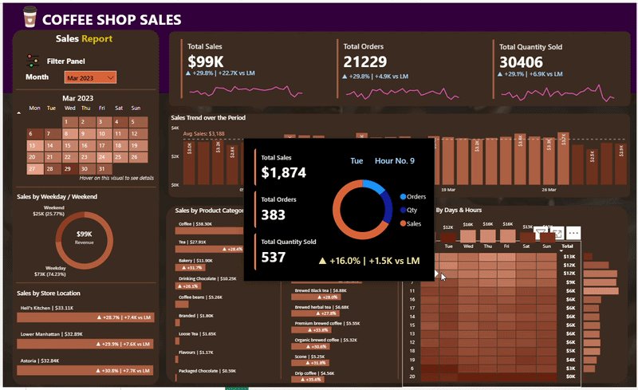

# Coffee Shop Sales Dashboard

## Project Overview

An interactive **Power BI dashboard** built to analyze coffee shop sales data, providing insights into sales performance, customer purchasing behavior, product trends, and store performance. SQL was used for data cleaning, transformation, and validation of the dashboard metrics.

## Dataset
The [dataset](https://docs.google.com/spreadsheets/d/19KgEh7QVbczZhUhIc2ulb9Y1LWNc2NGE/edit?usp=drive_link&ouid=103713302375895814079&rtpof=true&sd=true) contains 1,49,456 records.
The raw data was cleaned and transformed before visualization.

---

## Dashboard Features

### Visualizations
- Calendar Heat Map (Dynamic)
- Daily Sales Analysis with Average Sales Line
- Sales by Weekday vs Weekend
- Sales by Store Location
- Sales by Product Category
- Top 10 Products by Sales
- Sales by Day & Hour Heat Map
- Sparkline Trend Charts
- Interactive Tooltips displaying Sales, Orders, and Quantity Sold

## Analysis Performed

The dashboard provides insights into:

- Overall Sales Performance
- Total Orders Analysis
- Total Quantity Sold Analysis
- Month-over-Month Performance
- Daily Sales Trends
- Average Daily Sales
- Weekday vs Weekend Sales
- Store-wise Sales Performance
- Product Category Contribution
- Top 10 Best-Selling Products
- Peak Sales Hours
- Peak Sales Days
- Customer Purchasing Patterns

## Tools & Techniques Used

### Power BI

- Data Modeling
- DAX Measures
- KPI Cards
- Heat Maps
- Bar Charts
- Donut Charts
- Sparkline Charts
- Interactive Tooltips
- Conditional Formatting
- Dynamic Slicers
- ToolTip used for date

- ToolTip used for day and hour

### DAX Functions

- `TOTALMTD()`
- `SELECTEDVALUE()`
- `AVERAGEX()`
- `FORMAT()`
- Time Intelligence Functions
- Custom Month-over-Month (MoM) Calculations

### SQL

SQL was used to:

- Clean the raw dataset
- Convert date columns into appropriate date formats
- Remove null and inconsistent records
- Transform the data for analysis
- Validate Power BI dashboard calculations
- Write optimized queries for dashboard metrics and insights

## Key Insights

- Coffee generated the highest revenue among all product categories.
- Weekday sales were higher than weekend sales.
- Hell's Kitchen recorded the highest sales among all store locations.
- Morning hours experienced the highest customer activity.
- A few products contributed significantly to the overall revenue.
- The calendar heat map effectively highlighted high-performing sales days.
- Month-over-Month KPIs made it easy to monitor sales growth and decline.
